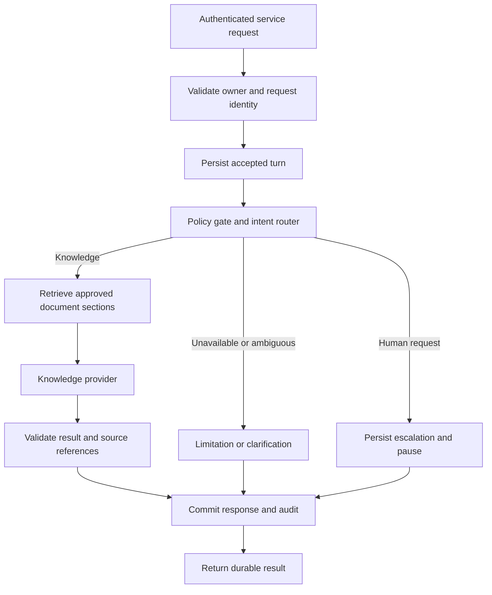

<!-- Proposes platform architecture and Feature 002 technical boundaries before implementation. -->

# VerityCX Platform Design

**Date**: 2026-09-12
**Status**: Feature 002 has a local implementation and deterministic evidence. The broader
platform, hosted acceptance and human-reviewed live acceptance remain incomplete; consult the
Feature 002 quickstart and task ledger before making release claims.
**Requirements**: [Feature 002](../specs/002-durable-knowledge-support/spec.md)
**Related**: [Roadmap](platform-roadmap.md), [threat model](threat-model.md)

## Purpose and Scope

Build a stateful banking-support platform with a LangGraph intent router, three specialists, policy
gates, typed shared state, interchangeable agent providers, PostgreSQL persistence, FastAPI, Chatwoot
handoff, Docker packaging and LangSmith traces/evaluations. Feature 002 delivers the knowledge path
and durable control boundaries. Other specialists, banking-state tools, actual Chatwoot delivery,
containers and official evaluation remain subsequent increments.

The initial deployment assumption is a local, single-organization English-language demo with
synthetic identities. There is no claim of real banking authentication or production readiness.
Planning must retain strict typing and documentation requirements from the constitution.

## Component Boundaries

Proposed packages under `src/veritycx/` are responsibilities for the future plan, not files created
by this document. Each package must receive its own README and documented, strictly typed contracts.

| Package | Responsibility and interface | Boundary |
| --- | --- | --- |
| `service` | FastAPI authentication, input validation, conversation/turn/status/resume/delete operations and health. | Derives owner from credentials, never caller-supplied owner fields. |
| `conversations` | Versioned state, turn lifecycle, authorization context, concurrency and request identity. | Owns transitions; external providers cannot replace state. |
| `orchestration` | LangGraph router and bounded knowledge/escalation paths. | Dispatches only registered capabilities; operational routes return unavailable in 002. |
| `knowledge` | Approved corpus manifest, section indexing, retrieval and citation provenance. | Accepts logical queries, never arbitrary filesystem paths or remote fetch instructions. |
| `policy` | Deterministic owner, source and capability checks, plus output validation. | Applied at service, retrieval and result-commit boundaries, not only as a graph node. |
| `providers` | Typed internal/vendor agent request/result protocol and adapters. | One live adapter plus deterministic substitute; no database credentials or direct tools. |
| `persistence` | PostgreSQL checkpoints, application records, deletion and recovery. | Checkpointer stores execution state; application records enforce ownership and result uniqueness. |
| `observability` | Local audit metadata and optional LangSmith export. | Allow-listed metadata only by default; exporter failure cannot change business outcomes. |
| `handoff` (later) | Chatwoot events, delivery reconciliation and human ownership. | External status is reconciled with durable local state. |
| `tools` (later) | Narrow synthetic banking commands. | Rechecks actor, resource, policy, approval and idempotency for each action. |

Existing `data_sources` remains the acquisition/validation boundary. Feature 002 adds a consumer
instead of expanding the setup script into an application server.

## Knowledge Turn Flow

Explicit human intent takes precedence over a model-selected knowledge route. Mixed requests that
need unavailable tools receive a limitation; no account mutation is inferred. The knowledge provider
receives selected evidence and bounded conversation context. It returns structured claims, citations
and a disposition: answer, clarify or abstain. The service never returns an unvalidated provider
object directly.

## Typed State and Provider Contract

Use explicit enums and closed boundary schemas. Pydantic is the proposed validation library for
external payloads; internal immutable values may be dataclasses. This is a design choice, not a claim
that the current constitution requires a specific library. Reject unknown privileged fields and
coercions that change identifiers, booleans or limits. Do not load arbitrary Python objects from
untrusted serialized data.

State contains `schema_version`, `conversation_id`, `owner_id`, `revision`, `corpus_version`, ordered
turn references, active route, workflow status, source references and optional escalation/pause.
Credentials, raw provider objects and full source collections are excluded. A server-issued demo
identity does not populate a future banking-verification field as verified.

Separate workflow status (`active`, `escalation_pending`, `deleted`) from turn status (`accepted`,
`running`, `completed`, `failed`). Knowledge, clarify, unavailable and escalation are result kinds.
Expired conversations are denied by expiry checks before any recovery or processing. A later human
integration adds `handoff_pending` and `human_owned` through an explicit schema migration.

The provider protocol accepts a request containing an opaque correlation identifier, permitted
capability, bounded messages, selected evidence, output schema version and remaining budget. It
returns a validated result containing disposition, answer claims, evidence references, provider/model
identity and usage when available. Categorized failures include timeout, rate limit, invalid output
and unavailable provider; unknown usage is recorded as unknown, not zero. Adapters cannot issue
arbitrary graph transitions, grant permissions or execute banking actions. A future vendor agent
must satisfy these same restrictions before substitution is accepted.

## Durable Execution and API Semantics

Use a PostgreSQL-backed LangGraph checkpointer for thread execution state. LangGraph distinguishes
thread checkpoints from cross-thread stores; an in-memory saver loses state on process restart.
[LangGraph persistence](https://docs.langchain.com/oss/python/langgraph/persistence)

Application conversation and turn records remain the authority for access and committed results.
Use an owner/conversation/request uniqueness constraint, content digest, monotonic revision and a
single active turn lease with fencing. Duplicate identical requests return the existing operation;
different content using the same identity returns conflict. A second distinct concurrent turn is
rejected with a retryable conflict before acceptance. Recovery takes an expired lease with a new
fence; stale workers cannot commit. Do not hold database transactions across model calls.

Acceptance, state transitions and response/audit commits use short database transactions. A model
call can repeat if the process dies before its result is committed; the guarantee is one committed
response, not exactly-once model billing. Checkpointer writes and application writes are not assumed
atomic: a recovery reconciler checks durable turn status before invoking or publishing results and
reuses completed records. Planning must specify and test each crash window and attempt-budget update.

Proposed HTTP surface:

| Operation | Contract |
| --- | --- |
| `POST /conversations` | Authenticated creation with request key; returns owner-bound identifier. |
| `POST /conversations/{id}/turns` | Validates message and request key; returns accepted operation identifier only after durable recording. |
| `GET /conversations/{id}` | Returns authorized conversation state and committed results. |
| `POST /conversations/{id}/resume` | Validates current pause identifier, owner, revision and request key. |
| `DELETE /conversations/{id}` | Blocks access and processing immediately; schedules full removal. |
| `GET /health/live`, `GET /health/ready` | Separate process liveness from required storage/corpus readiness; no secrets or connection strings. |

Use polling for 002; streaming is deferred. A recovery worker scans accepted/unfinished turns at
startup and periodically, so a disconnected request does not abandon durable work. At most two
provider attempts share a persisted 60-second deadline from first processing; worker downtime does
not reset it. Same-key retries return the terminal result; a new request is needed after terminal
failure. Define typed errors for unauthorized/not-found, invalid input, conflict, unavailable store,
invalid state and provider failure. Use the same not-found response for absent and foreign resources.

For the local demo, provision opaque bearer credentials mapped server-side to synthetic owners;
never accept a subject identifier as authentication. Bind the default service to loopback and keep
credentials out of tracked files. Public ingress and full identity-provider integration require a
later deployment/security specification.

## Retrieval and Evidence

Validate the existing pinned checkout and consume only its approved documents subtree. Build an
ignored, derived section index with lexical ranking and a manifest mapping document/section IDs to
source hashes and the upstream commit. This permits an initial retrieval baseline without embeddings
or a vector service. Bound retrieved passage count and context size in the implementation plan.

Reject linked/escaping paths, unsupported files, unclassified artifacts and evaluation semantics
before reading/indexing. Never follow document links automatically. Use project-authored synthetic
fixtures in CI; official content and derived indexes stay outside tracked project files. Check
manifest hashes and reject changed input rather than silently mixing corpus versions. Pin a corpus
version per conversation; rebuilding requires a new conversation or explicit future migration.

Output validation checks citation membership and source availability. It cannot prove every natural
language claim is entailed; acceptance therefore includes human-reviewed grounding and adversarial
cases. The model must abstain or clarify when evidence is insufficient or conflicting.

## Escalation and Future Chatwoot Integration

In 002, persist a deterministic, bounded summary derived from recorded messages, route, sources and
reason, mark `escalation_pending`, and pause specialist output. Return: request recorded, human inbox
not connected, nobody notified. Later messages are saved without specialist answers. The owner may
explicitly cancel the pending request and resume automation using the current pause identifier.

LangGraph interrupts support durable pauses and resumption on the same thread; the interrupted node
starts again on resume. Keep pre-interrupt work replay-safe and validate authorization outside the
model-controlled graph path. [LangGraph interrupts](https://docs.langchain.com/oss/python/langgraph/interrupts)

For the next feature, Chatwoot documents AgentBot webhooks, initial `pending` conversations, handoff
through `open`, and return to the bot through `pending`.
[Chatwoot AgentBot](https://www.chatwoot.com/hc/user-guide/articles/1677497472-how-to-use-agent-bots)

Map account/inbox/conversation IDs to an internal thread, authenticate incoming events using a
mechanism verified for the selected deployment, reject unwanted event types and deduplicate by
stable external identity. Ignore outgoing bot messages to prevent loops. Persist handoff intent
and outbound work before calling Chatwoot; reconcile uncertain delivery and status changes instead
of blindly repeating them. Suppress bot replies while handoff is pending or human-owned. A status
change alone does not prove a particular human has read or accepted the case. Return to automation
requires authorized, current external ownership evidence; a customer message cannot take ownership
away from a human. The 002 self-resume operation will be unavailable in `human_owned` state.

## Observability, Retention and Deployment

Commit sanitized audit metadata with each result. Optional LangSmith traces carry opaque correlation
IDs, route, source IDs, timings, provider/model configuration, usage and categorized failures.
Disable automatic raw prompt/output capture; test the actual export payload, including errors and
nested runs. LangSmith documents input/output hiding and processing controls that can support this
policy. [Trace privacy controls](https://docs.langchain.com/langsmith/mask-inputs-outputs)

Conversation records, checkpoints and local audit metadata share a 30-day idle expiry and a daily
purge deadline. Deletion first blocks access and revokes worker leases, then removes related records
within 24 hours. A removed conversation can never be recreated by turn submission; only the creation
operation issues a new server-generated ID. Planning must include checkpoint child tables and
in-flight workers in deletion tests. Synthetic-only demo storage uses no retained backups; a later
deployment must define backup and external trace retention before real data use.

Feature 002 requires a documented local PostgreSQL setup and migration procedure; Docker packaging
is a later feature. The final local stack will include the API, worker, database and separately
configured Chatwoot dependencies. Do not assume Chatwoot is part of the API container or shares its
application tables. Exact versions, image pins and deployment topology are planning deliverables.

## Validation and Planning Gate

Implement the specification's synthetic grounding, recovery, isolation, escalation, expiry and
load cases. Security tests must inspect capabilities and storage effects, not just reassuring model
text. Use the deterministic adapter for reproducible control-flow tests and a separate live run for
model grounding; passing a test double does not establish live-model quality.

The implementation plan must resolve exact dependency versions and strict-type compatibility,
provider/model choice, database schema/migrations, lease fencing, checkpoint reconciliation,
retrieval limits, boundary schemas, purge mechanics and opt-in evidence commands. Review these
documents before generating that plan. No proposed package, endpoint or guarantee is implemented yet.
