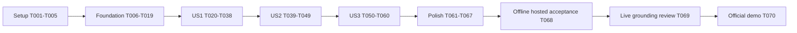

<!-- Defines dependency-ordered implementation and acceptance tasks for durable knowledge support. -->

# Tasks: Durable Knowledge-Support Workflow

**Created**: 2026-09-13
**Input**: Design artifacts in `specs/002-durable-knowledge-support/`.
**Prerequisites**: [plan.md](plan.md), [spec.md](spec.md), [research.md](research.md),
[data-model.md](data-model.md), [contracts](contracts/README.md), [quickstart.md](quickstart.md).
**Status**: Generated for implementation; every task is initially unchecked.
**Tests**: Required by FR-018 and SC-001–SC-008. Write regression/contract tests and observe the
expected failure before the corresponding implementation. Combined test-and-implementation tasks
perform those actions in that order.
**Organization**: Setup, shared foundations, US1, US2, US3, final acceptance.

## Format and Path Conventions

- Each task uses `- [ ] TNNN [P?] [USn?] description` and names its implementation or evidence files.
- All paths are relative to the single Git repository root. Parent source directories named in the
  same task remain under their explicitly stated root.
- `[P]` denotes independent test-authoring work in a listed parallel group after its shared
  prerequisites pass. It does not authorize concurrently changing shared fixtures, indexes or READMEs.
- Dependencies are explicit task IDs; ascending execution is always valid. Story-phase labels are
  mandatory only in the three story phases.
- Every new/changed source file uses conventional module comments and documented functions/classes,
  strict types and matching responsibility README updates. Shared README/index changes are integrated
  serially, with a final consistency pass in T066; never invent comments in JSON/lock files.
- Mark a task complete only after its described work and checks pass. Missing live credentials,
  human review or hosted evidence leave the relevant acceptance tasks open.
- This list does not change Feature 001 tasks or reviewer-owned checklist markers. It authorizes no
  automatic commit, push, paid run or deployment merely by being generated.

## Phase 1: Setup (Shared Infrastructure)

**Goal**: Prepare the existing root project, locked dependencies, isolated test scaffolding and configuration.

**Independent validation / checkpoint**: All setup checks pass; no application behavior is claimed.

- [X] T001 Add the direct runtime/test pins selected in `specs/002-durable-knowledge-support/research.md` to `pyproject.toml`, regenerate `uv.lock`, and verify locked Python 3.12 resolution without changing Feature 001 configuration. (No task dependencies.)
- [X] T002 Add `.cache/support/` and local credential ignore rules in `.gitignore`; create the planned responsibility packages and their `__init__.py`/README files under `src/veritycx/conversations/`, `service/`, `orchestration/`, `knowledge/`, `policy/`, `providers/`, `persistence/`, and `observability/`, documenting planned interfaces without claiming implementation. (Depends on: T001.)
- [X] T003 Establish native PostgreSQL 18.6 and dedicated app/test databases with separate roles per `specs/002-durable-knowledge-support/quickstart.md`, preserving existing databases; create `tests/support/conftest.py` and the unit/contract/integration/acceptance/fixtures READMEs; register `support_db`/`live` in `pyproject.toml`, exclude live execution by default, and provide synthetic factories, dedicated-database and owned-process guards. (Depends on: T002.)
- [X] T004 Write failing configuration and async-startup cases in `tests/support/unit/test_configuration.py` and `tests/support/unit/test_event_loop.py` for unknown settings, public binds, missing live credentials, secret-safe errors and Windows Selector startup (FR-012, FR-017). (Depends on: T003.)
- [X] T005 Implement closed settings and shared async bootstrap in `src/veritycx/service/configuration.py` and `src/veritycx/service/runtime.py`, plus `config/support.toml`; enforce the configuration contract, deterministic defaults, approved CLI overrides and Selector startup before connections, then pass T004. (Depends on: T004.)

## Phase 2: Foundational (Blocking Prerequisites)

**Goal**: Establish typed models, real database transactions, guarded checkpointing and authentication before story integration.

**Independent validation / checkpoint**: T019 must pass before any user-story integration. In particular, no graph may use an unverified guard-plus-saver transaction.

- [X] T006 Write failing strict wire/storage schema tests in `tests/support/unit/test_models.py` for duplicate JSON keys, unknown fields, UUID/time normalization, nonfinite numbers, integer/boolean confusion and unsupported versions (FR-012). (Depends on: T005.)
- [X] T007 Implement versioned entity/wire models in `src/veritycx/conversations/models.py`, `src/veritycx/knowledge/models.py`, `src/veritycx/providers/protocol.py`, `src/veritycx/persistence/models.py` and typed graph state in `src/veritycx/orchestration/state.py` per `data-model.md`; prohibit arbitrary provider/state objects and pass T006. (Depends on: T006.)
- [X] T008 Write failing native PostgreSQL migration/privilege tests in `tests/support/integration/test_migrations.py` for version/checksum drift, application/checkpoint schemas, runtime DDL denial and rollback; missing dedicated PostgreSQL must fail this marked suite, not skip. (Depends on: T007.)
- [X] T009 Implement commented schema SQL in `src/veritycx/persistence/migrations/001_support.sql` and checksummed migration runner in `src/veritycx/persistence/migrate.py`; create all planned entities, uniqueness/FK constraints, heartbeat/migration records and separate-role grants; run pinned saver setup only administratively and pass T008. (Depends on: T008.)
- [X] T010 Expose non-destructive `db migrate` in `scripts/manage_support.py` and document native PostgreSQL/role prerequisites in `scripts/README.md`; verify root invocation, safe exits and administrator-DSN isolation with `tests/support/contract/test_management.py` before completing this command. (Depends on: T009.)
- [X] T011 Implement bounded async pools, explicit transaction helpers and row validation in `src/veritycx/persistence/database.py`; use fixed schema paths, parameterized SQL, at most 20 connections/process and no DDL in runtime startup. (Depends on: T010.)
- [X] T012 Write failing transaction/identity tests in `tests/support/integration/test_repository.py` for owner-scoped operation uniqueness, canonical digests, atomic acceptance/audit, message limits, one active job, claim fences and database-time deadlines (FR-001, FR-007, FR-008, FR-013, FR-015). (Depends on: T011.)
- [X] T013 Implement shared repository primitives in `src/veritycx/persistence/repository.py` and command values in `src/veritycx/conversations/commands.py`: create/read, accept and claim work, one-second scans, 30-second lease/five-second heartbeat, monotonic fence, first-claim 60-second deadline and atomic audit/operation records; pass T012. (Depends on: T012.)
- [X] T014 [P] Write failing restricted serialization/restore tests in `tests/support/unit/test_checkpoint_serialization.py`, including built-in Interrupt round trips, malformed tags and foreign/version/corpus state (FR-012). (Depends on: T013.)
- [X] T015 [P] Write failing real-database saver tests in `tests/support/integration/test_checkpoint_transactions.py` proving parent guard, `aput`, `aput_writes`, blobs and pointer publication roll back together on one connection, and stale/absent/deleted parents cannot write (FR-007, FR-009, FR-016). (Depends on: T013.)
- [X] T016 Implement the guarded saver in `src/veritycx/persistence/checkpoints.py` with restricted JsonPlus, same-connection parent lock/fence/write transactions, authorized reads and published pointers; pass T014 and T015 before any graph integration, with no pooled-write fallback. (Depends on: T014, T015.)
- [X] T017 Write failing auth/token provisioning cases in `tests/support/contract/test_auth.py` for two owners, disabled/malformed credentials, constant-time digest comparison behavior, no token echo and refusal to overwrite local token files (FR-001). (Depends on: T016.)
- [X] T018 Implement bearer authentication in `src/veritycx/service/auth.py`, owner checks in `src/veritycx/policy/authorization.py`, and `auth init-demo` in `scripts/manage_support.py`; generate 256-bit tokens into ignored files, print paths only, separate admin secrets and pass T017. (Depends on: T017.)
- [X] T019 Run foundation unit/contract/native-database gates and strict typing; record exact commands, environment, transaction-rollback and Windows startup evidence in `specs/002-durable-knowledge-support/quickstart.md`; do not open story integration until T001–T018 pass. (Depends on: T018.)

## Phase 3: User Story 1 — Receive a grounded policy answer (Priority: P1)

**Goal**: Deliver the knowledge-support MVP with source attribution, abstention and unavailable-operation responses.

**Independent validation / checkpoint**: With authored synthetic documents and a deterministic provider, create an authorized conversation, ask supported/unsupported/conflicting questions, verify citations and safe limitations. No account tools or human inbox is needed. Live grounding is separately accepted in T069.

- [X] T020 [P] [US1] Write failing source/index tests in `tests/support/unit/test_corpus.py` and `tests/support/unit/test_retrieval.py` for closed JSON, 1 MiB limit, linked/escaping paths, duplicate IDs, pin/hash drift, forbidden-source canaries, deterministic sections/ranking and context bounds (FR-003, FR-004). (Depends on: T019.)
- [X] T021 [P] [US1] Write failing shared-provider contract tests in `tests/support/contract/test_providers.py` for structured output, selected-evidence membership, malformed output, SDK retry suppression, deadlines, usage unknowns and live-mode isolation (FR-004, FR-005, FR-012, FR-013, FR-018). (Depends on: T019.)
- [X] T022 [P] [US1] Write failing routing/policy tests in `tests/support/unit/test_routing.py` for knowledge, unsupported operations, human intent priority, negation/paraphrases, mixed requests, customer/document injection and absence of banking capabilities (FR-002, FR-005, FR-006). (Depends on: T019.)
- [X] T023 [P] [US1] Write failing create/submit/poll HTTP tests in `tests/support/contract/test_conversation_api.py` covering exact schemas/statuses, same-key retries, foreign/absent equality, 64 KiB body and 8,000-code-point limits, secret-safe errors and acknowledgment after commit (FR-001, FR-007, FR-008, FR-012, FR-015, FR-017). (Depends on: T019.)
- [X] T024 [US1] Implement closed document parsing and non-following source guards in `src/veritycx/knowledge/documents.py` and `src/veritycx/policy/sources.py`; limit runtime reads to approved document bytes, never invoking the acquisition inspector or reading banking/task artifacts; satisfy parser/source cases from T020. (Depends on: T020.)
- [X] T025 [US1] Implement prepare/approve manifests and deterministic section indexing in `src/veritycx/knowledge/manifest.py` and `src/veritycx/knowledge/index.py`; bind exact pin/path/hash/classification, reject changed approval inputs, use stable 2,000-code-point section anchors and ignored per-mode artifacts. (Depends on: T024.)
- [X] T026 [US1] Implement lexical weighting and stable tie-breaks in `src/veritycx/knowledge/retrieval.py`; enforce six positive-score sections/12,000 evidence code points, 16,000 prior-context code points, version pinning and clarification for missing evidence; pass remaining T020 cases. (Depends on: T025.)
- [X] T027 [US1] Add `corpus prepare --mode` and `corpus approve --hash` to `scripts/manage_support.py`, extend `tests/support/contract/test_management.py` before implementation, and prove fixed synthetic/official source modes, safe summaries, no overwrite/allow-list expansion and root-relative behavior. (Depends on: T026.)
- [X] T028 [US1] Implement the finite synthetic provider in `src/veritycx/providers/deterministic.py` and freeze 40 authored questions/documents with expected facts and admissible sections in `tests/support/fixtures/grounding.json` and `tests/support/fixtures/documents/`; label fixture provenance and disable test fault controls in normal runtime. (Depends on: T021, T027.)
- [X] T029 [US1] Implement the selected Responses adapter in `src/veritycx/providers/openai.py` with snapshot from research, no tools, closed outputs, `store=false`, 2,048 output-token cap, SDK retries zero, httpx2-compatible test transport and sanitized failures; pass T021 without live calls. (Depends on: T028.)
- [X] T030 [US1] Implement deterministic intent rules in `src/veritycx/orchestration/router.py` and result/citation checks in `src/veritycx/policy/outputs.py`; no provider calls in routing, no privileged state from output, and no claim of operational execution; pass T022 and output cases in T021. (Depends on: T022, T029.)
- [X] T031 [US1] Implement persisted attempt reservations/result reuse in `src/veritycx/persistence/attempts.py`, bounded invocation in `src/veritycx/providers/execution.py` and sanitized audit values in `src/veritycx/observability/audit.py`; two attempts share the first-claim deadline, reserve before dispatch and commit validated output before graph progress (FR-009, FR-013, FR-014). (Depends on: T030.)
- [X] T032 [US1] Implement the knowledge-only graph in `src/veritycx/orchestration/graph.py` using guarded persistence, bounded context, policy gates, provider journal and durable result commit; human requests remain an explicitly unfinished US3 path, never a fabricated delivered handoff. (Depends on: T031.)
- [X] T033 [US1] Implement create/submit/poll endpoints and sanitized error middleware in `src/veritycx/service/app.py` and `src/veritycx/service/routes.py`; derive ownership server-side, reject unknown payload fields, honor duplicate-before-busy/count checks and pass T023. (Depends on: T023, T032.)
- [X] T034 [US1] Implement normal job execution/heartbeats in `src/veritycx/orchestration/worker.py` and API launcher in `src/veritycx/service/main.py`; use Selector-compatible startup, bounded concurrency, first-claim budget, graceful shutdown and no reload/multiprocess assumptions. (Depends on: T033.)
- [X] T035 [US1] Write readiness/liveness cases in `tests/support/contract/test_health.py`, then implement safe health handlers in `src/veritycx/service/health.py` for schema/storage/corpus/worker freshness and a maintenance-status interface; optional exporter state must not gate readiness. (Depends on: T034.)
- [X] T036 [US1] First write failing dedicated-database and owned-process safety tests in `tests/support/contract/test_validation_cli.py`, then implement the initial owned-process validation driver in `scripts/validate_support.py` and knowledge acceptance tests in `tests/support/acceptance/test_knowledge.py`; run synthetic question/clarification/abstention paths through real HTTP/worker/database boundaries, rejecting nondedicated test databases and unowned process cleanup. (Depends on: T035.)
- [X] T037 [US1] Run US1 offline cases, including grounded fixture answers, no banking reads/tools, source canaries and provider output rejection; record reproducible results in `specs/002-durable-knowledge-support/quickstart.md`, labeling deterministic results as control-flow evidence only. (Depends on: T036.)
- [X] T038 [US1] Document the knowledge MVP and its remaining recovery/escalation/live-review limitations in `src/veritycx/knowledge/README.md`, `src/veritycx/providers/README.md`, `src/veritycx/service/README.md` and `specs/002-durable-knowledge-support/quickstart.md`; verify it independently without claiming SC-001 or full Feature 002 completion. (Depends on: T037.)

## Phase 4: User Story 2 — Continue reliably after interruption (Priority: P2)

**Goal**: Add recoverable continuation, bounded replay, concurrent-request correctness and deletion/expiry safety.

**Independent validation / checkpoint**: Use actual API/worker subprocesses and PostgreSQL with a deterministic provider. All 20 SC-002 cases preserve accepted messages and one committed result; budget, stale-writer, expiry and ownership cases pass.

- [X] T039 [P] [US2] Write failing subprocess recovery/concurrency cases in `tests/support/integration/test_recovery.py`: the five SC-002 scenarios repeated four times, plus terminal-result/checkpoint lag and corrupted-pointer restoration; inspect accepted rows and unique responses. (Depends on: T038.)
- [X] T040 [P] [US2] Write failing budget/fence cases in `tests/support/integration/test_attempt_recovery.py` for crash after reservation, journal reuse, stale provider completion, deadline across restart, invalid-output retry and no hidden third call (FR-009, FR-013). (Depends on: T038.)
- [X] T041 [P] [US2] Write failing deletion/expiry cases in `tests/support/integration/test_retention.py` for immediate access denial, separate maintenance authorization for deleted/expired parents, rejection of live-parent purge, atomic checkpoint/child-table purge rollback, late saver/pending writes before and after purge, idle extension rules and controlled-time overdue cleanup (FR-016, SC-007). (Depends on: T038.)
- [X] T042 [US2] Implement restart/takeover reconciliation in `src/veritycx/orchestration/recovery.py` and integrate with `src/veritycx/orchestration/worker.py`; select published pointers, hydrate authoritative history, repair terminal bookkeeping without model replay and fail closed on incompatible state. (Depends on: T039.)
- [X] T043 [US2] Complete reservation/journal/finalization race handling in `src/veritycx/persistence/attempts.py`, `src/veritycx/persistence/repository.py` and `src/veritycx/persistence/checkpoints.py`; reject stale fences at every write, preserve consumed attempts/deadlines and pass T040. (Depends on: T040, T042.)
- [X] T044 [US2] Implement hourly/startup cleanup in `src/veritycx/persistence/maintenance.py` and `db purge-expired` in `scripts/manage_support.py`; use the deletion-only maintenance guard and same-connection parent-lock transaction, invalidate fences first, delete checkpoint blobs/pending writes and all content/operation/audit rows with parent last, prune old worker heartbeats and publish overdue status to health. (Depends on: T041, T043.)
- [X] T045 [US2] Write DELETE/idempotency tests in `tests/support/contract/test_delete_api.py`, then implement owner-authorized deletion and retained identical-delete acknowledgment in `src/veritycx/service/routes.py`; prohibit resurrection and do not return deleted content. (Depends on: T044.)
- [X] T046 [US2] Extend owned fault hooks and subprocess restart control in `scripts/validate_support.py` and `tests/support/acceptance/test_continuity.py`; pass T039–T041 against real PostgreSQL, including guard-plus-saver rollback and no lost/duplicate committed turn. (Depends on: T045.)
- [X] T047 [US2] Add and run deterministic load acceptance in `tests/support/acceptance/test_load.py`: 10 conversations times three turns, identical one-second production scan, queue-inclusive nearest-rank p95 at most five seconds and no cross-owner leakage (SC-005). (Depends on: T046.)
- [X] T048 [US2] Execute storage-outage, message-count edges, schema mismatch, attempt exhaustion, expiry and in-flight deletion gates via `tests/support/acceptance/test_continuity.py`; verify failed terminal keys remain stable and interrupted work cannot recreate purged rows (SC-002, SC-007). (Depends on: T047.)
- [X] T049 [US2] Record US2 fault-hook names, attempt counts, safe DB row counts, environment and measured latency in `specs/002-durable-knowledge-support/quickstart.md`; update `src/veritycx/persistence/README.md` and `src/veritycx/orchestration/README.md` with recovery/operator failure behavior. (Depends on: T048.)

## Phase 5: User Story 3 — Request escalation without losing context (Priority: P3)

**Goal**: Persist truthful pending escalation, suppress specialist replies and support authorized, crash-safe resumption.

**Independent validation / checkpoint**: With no external inbox, run all six SC-004 cases and additional interrupt-repair/tampering faults. Context survives restart, nobody is falsely reported notified, and a pause is consumed once.

- [X] T050 [P] [US3] Write failing escalation/paused-message cases in `tests/support/integration/test_escalation.py` for deterministic summary, pending record, duplicate request, no specialist while paused and preservation of later messages (FR-010). (Depends on: T049.)
- [X] T051 [P] [US3] Write failing resume API/tampering cases in `tests/support/contract/test_resume_api.py` for owner/pause/revision validation, explicit true, same-key retry, conflicting/stale/foreign payloads and rejection of arbitrary graph commands (FR-001, FR-011). (Depends on: T049.)
- [X] T052 [P] [US3] Write failing interrupt crash-repair cases in `tests/support/integration/test_interrupt_recovery.py` for result-before-interrupt checkpoint, consumed pause before Command, repeated interrupted node, latest paused history, transient recovery of the same job, terminal failure polling, atomic fresh-pause retry with failed-worker fencing, operator-blocked corrupt state and no duplicate escalation/response; cover the HTTP projection in `tests/support/contract/test_resume_api.py`. (Depends on: T049.)
- [X] T053 [US3] Implement deterministic bounded escalation summary and transition commands in `src/veritycx/conversations/lifecycle.py`; include reason, factual context and sources, maintain the 4,000-code-point summary limit and permanent `not_connected` delivery truth for this feature. (Depends on: T050.)
- [X] T054 [US3] Implement transactional pause/consume/resume-job operations in `src/veritycx/persistence/escalations.py`; one pending pause, atomic result/audit, one consumed operation and output gating until resume finalization, using existing parent/job lock order. (Depends on: T053.)
- [X] T055 [US3] Integrate idempotent escalation and restricted same-thread interrupts in `src/veritycx/orchestration/graph.py`; save truthful response before pause, recover missing interrupt from the durable record and never let graph state replace authoritative ownership/history. (Depends on: T054.)
- [X] T056 [US3] Implement the resume endpoint in `src/veritycx/service/routes.py` with current pause/revision, authorized operation digest and durable control-job acceptance; pass T051 and preserve original results on identical retries. (Depends on: T051, T055.)
- [X] T057 [US3] Implement pause-repair/resume control execution in `src/veritycx/orchestration/recovery.py` and `src/veritycx/orchestration/worker.py`; consume no provider attempts, reconcile Command delivery, preserve newer paused messages, implement terminal failure/fresh-pause and operator-required transitions, expose resume operation status through `src/veritycx/service/routes.py` and pass T052. (Depends on: T052, T056.)
- [X] T058 [US3] Integrate paused-message acceptance in `src/veritycx/persistence/escalations.py` and `src/veritycx/service/routes.py`; save context and truthful acknowledgment without graph/model invocation, count messages/activity once, and reject new work while a resume job is active; pass T050. (Depends on: T057.)
- [X] T059 [US3] Extend end-to-end scenarios in `scripts/validate_support.py` and `tests/support/acceptance/test_handoff.py` for all six SC-004 cases plus forged resume and restart between pause consumption/finalization; verify summary/context and zero fabricated notification claims. (Depends on: T058.)
- [X] T060 [US3] Run the complete US3 contract/integration suite with the deterministic adapter and record evidence in `specs/002-durable-knowledge-support/quickstart.md`; update `src/veritycx/conversations/README.md` with pending, cancellation and resume behavior. (Depends on: T059.)

## Phase 6: Polish and Cross-Cutting Acceptance

**Goal**: Finish privacy/export, adversarial validation, documentation, CI and separate live acceptance.

**Independent validation / checkpoint**: Feature completion requires recorded offline/hosted evidence plus T069 human-reviewed grounding and T070 live demonstration. No current task marker asserts implementation or release acceptance.

- [X] T061 [P] Write failing audit/export canary cases in `tests/support/unit/test_trace_privacy.py` for nested spans, error paths, inherited auto-tracing, no owner/conversation/body/secret export, nullable usage and exporter failure isolation (FR-014, SC-006). (Depends on: T060.)
- [X] T062 [P] Write failing cases for newly introduced live validation safeguards and retain regression coverage of the T036 database/process protections in `tests/support/contract/test_validation_cli.py` for explicit live opt-in, synthetic/official suite selection, missing credentials, dedicated databases, owned process lifecycle, no raw evidence files and pending human-review status (FR-018). (Depends on: T060.)
- [X] T063 Implement explicit metadata-only LangSmith export in `src/veritycx/observability/export.py` and connect durable local audit in `src/veritycx/observability/audit.py`; disable ambient/raw capture, sanitize errors and pass T061 without an external trace account. (Depends on: T061, T062.)
- [X] T064 Finish offline/grounding/demo suites in `scripts/validate_support.py` and the 30-case six-category adversarial inventory in `tests/support/fixtures/security.json` plus `tests/support/acceptance/test_security.py`; preserve synthetic-only CI, actual effects assertions and manual grounding review, then pass T062. (Depends on: T063.)
- [X] T065 Add native PostgreSQL integration CI in `.github/workflows/support-integration.yml` and align `.github/workflows/quality.yml` selections: three-OS `not support_db and not live`, native full offline suite including database tests; record exact DB/runner/tool versions and fail missing database setup rather than skipping. (Depends on: T064.)
- [X] T066 Reconcile public commands, module interfaces, limits, marker selection, observed threats and implemented scope in `README.md`, `docs/README.md`, `docs/platform-design.md`, `docs/threat-model.md`, `.github/workflows/README.md`, `config/README.md`, `scripts/README.md`, `src/veritycx/README.md` and `tests/support/README.md`; update every new package/test/migration README in the same change set. (Depends on: T065.)
- [X] T067 Run locked install, Ruff format/lint, strict mypy, Markdown/YAML, full offline pytest and root-entry tests using `specs/002-durable-knowledge-support/quickstart.md`; record results there and audit tracked files for secrets, upstream bodies, derived indexes and unsupported comment hacks before release review. (Depends on: T066.)
- [ ] T068 Execute the full offline validator and retain passing three-OS fixture plus native PostgreSQL hosted-job evidence for the final candidate in `specs/002-durable-knowledge-support/quickstart.md`; map SC-002–SC-007 and offline SC-008 to actual logs, correcting failures without replacing them with mock-only results. (Depends on: T067.)
- [ ] T069 Run the opt-in live synthetic grounding suite through `scripts/validate_support.py` and record the frozen 40-case rubric review in `specs/002-durable-knowledge-support/quickstart.md`; require human assessment and exact SC-001 thresholds, record provider/model/corpus/prompt versions and unknown usage/cost honestly, and leave this task open if credentials or review are unavailable. (Depends on: T068.)
- [ ] T070 Run the opt-in official-document restart/escalation/resume demo via `scripts/validate_support.py` and record sanitized SC-008 evidence in `specs/002-durable-knowledge-support/quickstart.md`; verify the existing Feature 001 acceptance ledger in `docs/platform-roadmap.md` before any dependent release claim, and require live demonstration evidence and truthful `delivery=not_connected` status; reject any claim that a human was notified. (Depends on: T069.)

## Dependencies and Execution Order

US2 extends US1's actual service/worker, and US3 extends its recovery path. They are independently
testable with the deterministic provider after their stated predecessors; whole-story implementation
is deliberately sequential because graph, worker and repository files are shared. There is no claim
that all stories can be implemented simultaneously. US1 is useful without the subsequent story
capabilities, but is only a provisional knowledge MVP until live grounding is reviewed.

### Parallel Execution Examples

| Group | Ready after | Independent tasks | Files stay disjoint |
| --- | --- | --- | --- |
| Foundation tests | T013 | T014, T015 | Serializer unit tests versus PostgreSQL transaction tests. |
| US1 tests | T019 | T020, T021, T022, T023 | Corpus/retrieval, provider, routing and HTTP contract files. |
| US2 tests | T038 | T039, T040, T041 | Recovery, attempt recovery and retention test files. |
| US3 tests | T049 | T050, T051, T052 | Escalation, resume API and interrupt recovery files. |
| Final tests | T060 | T061, T062 | Trace privacy and validation CLI test files. |

For example, after T019 run the corpus tests authoring task and provider-contract authoring task
concurrently; join each test task before its dependent implementation. After T038, recovery and
retention tests may be authored concurrently, but T042–T046 integration remains ordered. After T049,
resume-API tests may be authored alongside escalation tests; do not edit the shared routes file in
parallel. These are execution opportunities, not a requirement to launch agents.

## Requirement and Acceptance Coverage

| Requirement | Principal implementation / validation tasks |
| --- | --- |
| FR-001 | T017–T018, T023, T033, T045, T051, T056 |
| FR-002 | T022, T030, T032 |
| FR-003 | T020, T024–T027, T037, T064 |
| FR-004 | T020–T021, T026, T028–T030, T037, T069 |
| FR-005 | T021–T022, T024, T030, T064 |
| FR-006 | T022, T024, T030, T037 |
| FR-007 | T012–T016, T023, T031–T034, T039, T042, T046 |
| FR-008 | T012–T013, T023, T033, T039, T045, T048 |
| FR-009 | T014–T016, T031, T039–T043, T046 |
| FR-010 | T050, T053–T055, T058–T060 |
| FR-011 | T051–T052, T054–T060 |
| FR-012 | T004–T007, T014, T021, T023, T029–T030, T033, T048 |
| FR-013 | T012–T013, T021, T029, T031, T040, T043, T048 |
| FR-014 | T012–T013, T031, T061, T063, T068 |
| FR-015 | T012–T013, T023, T033, T048, T058 |
| FR-016 | T015–T016, T041, T044–T048 |
| FR-017 | T004–T005, T023, T033–T036, T044–T045, T065–T067 |
| FR-018 | T003, T021, T028–T029, T036, T062, T064–T070 |

| Criterion | Recorded completion gate |
| --- | --- |
| SC-001 | T069: live 40-case human review, at least 18/20 supported and all unsupported/ambiguous cases pass. |
| SC-002 | T046/T048, reconfirmed T068: five fault scenarios repeated four times; accepted-message preservation and unique committed answers. |
| SC-003 | T064/T068: five cases in each of six adversarial categories, asserting actual access/state effects. |
| SC-004 | T059/T060, reconfirmed T068: all six escalation cases plus interrupt crash recovery. |
| SC-005 | T047/T068: 10 conversations, three turns each, queue-inclusive p95 at most five seconds. |
| SC-006 | T061/T063/T068: acceptance audit completeness and zero secret/body canaries in exports/errors. |
| SC-007 | T041/T044–T048/T068: limits, outages, incompatible state, budget and controlled-time retention with an unfinished turn. |
| SC-008 | T068 offline portion and T070 live official-document restart/handoff-boundary demonstration. |

TM-01–TM-13 controls are covered by these cases plus the explicit guarded-saver fault gates.
TM-14–TM-18, Chatwoot delivery, banking operations, Docker/public deployment and official benchmark
evaluation remain future features. Feature 001 acceptance is a distinct prerequisite for a dependent
release claim, not work silently marked completed by this list.

## Implementation Strategy

### MVP First

1. Complete setup and pass the guarded-persistence/authentication foundation.
1. Deliver US1 and its standalone synthetic knowledge workflow.
1. Demonstrate supported answers, abstention and citations; label it a provisional knowledge MVP.
1. Do not claim recovery, human delivery or live-model grounding from that initial demonstration.

### Incremental Delivery

1. US2 proves continuation, at-most-one committed response and no resurrection using actual crashes.
1. US3 proves truthful escalation, preserved context and authorized resumption without an inbox.
1. Final gates add complete export/adversarial evidence, hosted results, live human grounding review
   and the official-document demonstration.
1. Complete Feature 002 only when all required evidence is retained; missing infrastructure or
   credentials is an open acceptance task, not a substitute pass.

## Generation Validation Summary

70 tasks: 5 setup, 14 foundation, 19 US1, 11 US2, 11 US3 and 10 final acceptance.
14 tasks have explicit parallel opportunities across five disjoint test-authoring groups.
All task IDs are unique and sequential, all dependencies point backward, and each task names files.
No implementation task is checked, and no existing feature/checklist is regenerated.

## Phase 7: Convergence

Assessment: 2026-09-19. Outcome: `tasks_appended`. Local tests pass, but the
following gaps prevent a convergence claim. T068-T070 retain their existing
hosted/live acceptance obligations; the tasks below address newly identified
implementation and verification gaps.

- [ ] T071 Reject false account/transaction completion and human-notification claims across all provider dispositions in `src/veritycx/policy/outputs.py`; add schema-valid, valid-citation adversarial outputs to `tests/support/acceptance/test_security.py` and verify no such text reaches a committed customer result per FR-006, FR-010 and FR-005 (contradicts; HIGH; F1).
- [ ] T072 Normalize malformed checkpoint/blob/pending-write deserialization failures into sanitized `incompatible_state` handling in `src/veritycx/persistence/checkpoints.py` and `src/veritycx/orchestration/recovery.py`; preserve evidence, fence failed workers, expose operator-required status and prohibit repeated unsafe replay; prove behavior using corrupt stored bytes in native integration tests per FR-012 and T057 (partial; HIGH; F2).
- [ ] T073 Strengthen the five document-injection and five malformed-provider cases in `tests/support/acceptance/test_security.py` to traverse real corpus/provider/graph publication boundaries with controlled untrusted inputs, instrument forbidden accesses and assert durable state/output effects; keep deterministic evidence explicitly distinct from live-model grounding per SC-003, FR-003, FR-005 and T064 (partial; HIGH; F3).
- [ ] T074 Add native crash/fencing tests in `tests/support/integration/test_interrupt_recovery.py` for interruption after `Command(resume=...)` checkpoint completion but before `finalize_resume`, repeated same-job recovery, preserved newer paused history, zero provider attempts and failed-original-key polling after a fresh-pause retry; repair any exposed implementation defects per FR-009, FR-011 and T052 (partial; HIGH; F4).
- [ ] T075 Add a documented, authorized per-case review workflow for the live 40-case grounding run in `src/veritycx/service/validation.py`, `scripts/validate_support.py` and `specs/002-durable-knowledge-support/quickstart.md`; make answers/evidence reviewable without committing raw bodies, retain rubric outcomes and run/configuration association, enforce the exact 18/20, 10/10 and 10/10 thresholds, and keep absent human review explicitly pending per SC-001, FR-018 and T064 (partial; HIGH; F5).
- [ ] T076 Exercise actual worker/graph/provider execution under inherited tracing settings in `tests/support/unit/test_trace_privacy.py` or a dedicated native integration test; intercept every export/automatic span, seed body/secret/owner canaries, inject exporter failures after audit commit and verify unchanged durable customer results and complete local audit per SC-006, FR-014 and T061 (partial; HIGH; F6).
